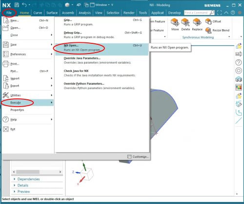
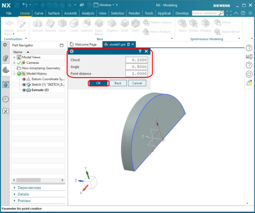
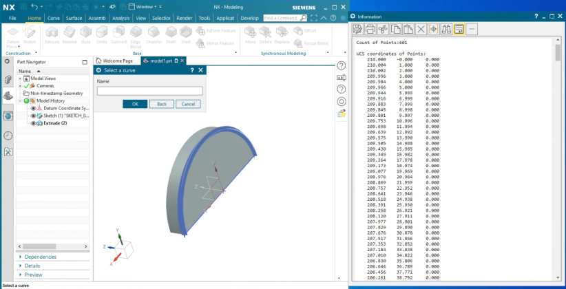

# NX Curve Sampling

The NX Curve Sampling user function will read coordinates on a curve and print the coordinates of uniformly
spaced points along the curve to the "Information" window. This is typically used to transfer coordinates to
other tools, such as robot path planners, that need curve information based on CAD geometry.

The uniform points are generated using the `UF_MODL_ask_curve_points` NX Open function.

## Download

See "Releases" for built files. The `nx_curve_sampling.dll` file is a compiled version of the user function.

## Usage

The `nx_curve_sampling.dll` is an "NX Open" function that is applied to a model. Begin by opening a model
that has a curve to be sampled. Click "File" -> "Execute" -> "NX Open".

Select `nx_curve_sampling.dll` in the open dialog and click "OK".

Set the "Chord", "Angle", and "Point distance" parameters.

| Parameter | Definition | Remarks |
| ---       | ---        | ---     |
| Chord | Chordal tolerance | Maximum allowable distance from a chord to the curve between ends of the chord |
| Angle | Angular tolerance | Maximum allowable sum of the angles between the chord and the tangents to the curve at the ends of the chord |
| Point distance | Maximum allowable chordal length | |

Click OK once the parameters have been configured.

"Select a Curve" will be displayed. Click on the curve of interest. The "Information" window will
show with the coordinates of the points on the curve. The points will also be displayed on the part.
Cut and paste the coordinates from the "Information" window to a text file or Excel.

Press "Cancel" to exit the curve selection. Use "Undo" to remove the points from the object if they do not clear.

# Building

The user function is compiled using CMake. The DLL must be built using Visual Studio 2015 (toolkit v140). This
can be selected during configuration. The Visual Studio 2015 C++ Toolchain can be installed using the Visual Studio
Installer, and is an optional package available for all versions of Visual Studio. The `NX_ROOT_DIR` CMake variable
can be used to specify the install location of NX if it is not detected automatically.

Most users will not need to build the DLL, and can use the binary file found in "Releases".

